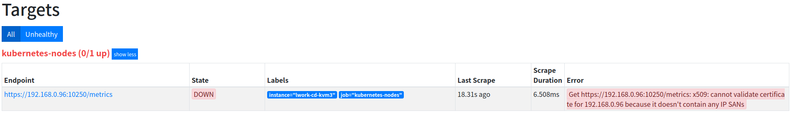
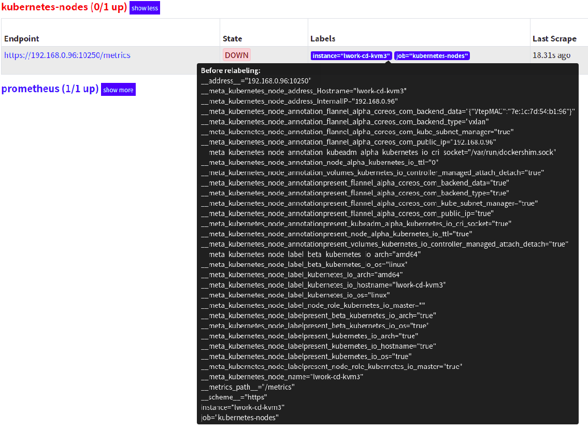

# 服务发现配置

kubeadm搭建了一套k8s 1.15.1,prometheus2.11.1 Prometheus 通过与kubernetes API集成来完成自动发现，目前在k8s主要支持5种服务发现模式： Node、Service、Pod、Endpoints和Ingress 获取当前集群中的所有节点信息，就需要利用**Node的服务发现模式**，在prometheus.yml文件中配置如下job即可

```text
    - job_name: 'kubernetes-nodes'
      kubernetes_sd_configs:
      - role: node
```

当前环境是使用的configmap挂载的prometheus.yml，所以更新configmap `kubectl apply -f prometheus-configmap.yaml`，10秒左右，配置文件自动更新，但是prometheus并不会自动更新配置文件，需要手动`curl -X POST "http://10.108.85.114:9090/-/reload"` 其中地址是prometheus在k8s中的service地址。

```text
root@lwork-cd-kvm3:~/tony/monitoring-test/prometheus# kubectl get svc -n monitoring
NAME                                    TYPE              CLUSTER-IP      EXTERNAL-IP   PORT(S)          AGE
prometheus                       NodePort    10.108.85.114   <none>              9090:30090/TCP   28h
```

使用节点ip+30090访问prometheus的dashboard，查看Targets页面是否能正常抓取数据  可以看到kubernetes-nodes这个job已经自动发现了Node节点，但是获取数据的时候失败，是因为prometheus在发现node模式的service时，访问的端口默认是10250，目前kubelet在该端口下已经没有metrics指标数据了，如果需要获取主机的监控信息，就需要借助node-exporter。 **利用relabe\_configs中的replace功能,relabe可以在prometheus采集数据之前，通过target实例的Metadata信息动态重新写入标签的值，除此之外，还能根据Target实例的Metadata信息选择是否采集或者忽略该Target实例**。  比如这里可以匹配_address_这个标签，然后替换其中的端口

```text
    - job_name: 'kubernetes-nodes'
      kubernetes_sd_configs:
      - role: node
      relabel_configs:
      - source_labels: [__address__] ###before relabeling的target的metadata信息
        regex: '(.*):10250' #匹配__address__，将host部分留下
        replacement: '${1}:9100'#将端口换为9100，其中${1}是正则表达式(.*)从__address__捕获到的内容留下host
        target_label: __address__ #目标
        action: replace #动作为替换
      - regex: __meta_kubernetes_node_label_(.+)#正则匹配__meta_kubernetes_node_label_
        action: labelmap#赋予新label
```

**例子**

```text
      - source_labels: [__meta_kubernetes_node_name]
        regex: (.+)
        target_label: __metrics_path__
        replacement: /api/v1/nodes/${1}/proxy/metrics#其中${1}是正则表达式(.+)__meta_kubernetes_node_name的值中捕获的内容
```

```text
    relabel_configs:
    - source_labels:  ["__meta_consul_dc"]
      regex: "dc1"
      action: keep
```

上述配置表示只要指标的“\_\_meta\_consul\_dc”这个标签的值含有“dc1”，就保留这个指标。

当action设置为keep时，Prometheus会丢弃source\_labels的值中没有匹配到regex正则表达式内容的Target实例，而当action设置为drop时，则会丢弃那些source\_labels的值匹配到regex正则表达式内容的Target实例。

