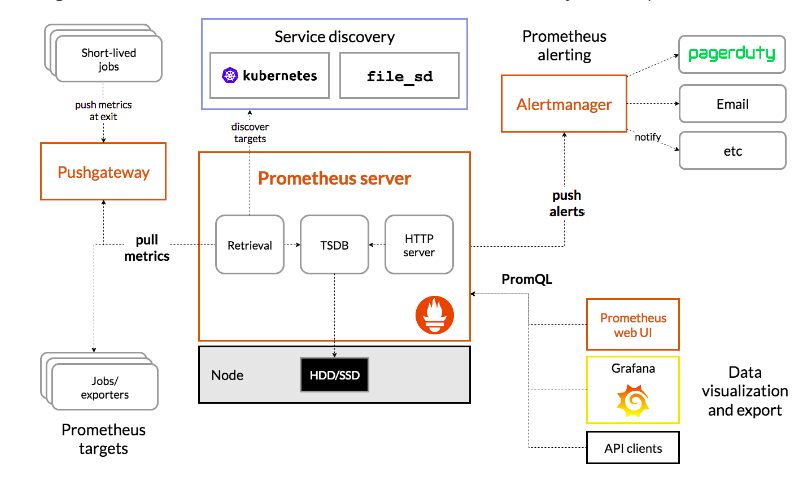

# prometheus基本架构

## **基本原理**

Prometheus从exporter拉取数据，或者间接地通过网关gateway拉取数据（如果在k8s内部署，可以使用服务发现的方式），它默认本地存储抓取的所有数据，并通过一定规则进行清理和整理数据，并把得到的结果存储到新的时间序列中，采集到的数据有两个去向，一个是报警，另一个是可视化。PromQL和其他API可视化地展示收集的数据，并通过Alertmanager提供报警能力。输出被监控组件信息的HTTP接口被叫做exporter 。目前互联网公司常用的组件大部分都有exporter可以直接使用，比如Varnish、Haproxy、Nginx、MySQL、Linux系统信息\(包括磁盘、内存、CPU、网络等等\)。

## **主要监控：**

* Node:如主机CPU，内存，网络吞吐和带宽占用，磁盘I/O和磁盘使用等指标。node-exporter采集。
* 容器关键指标:集群中容器的CPU详细状况，内存详细状况，Network，FileSystem和Subcontainer等。通过cadvisor采集。
* Kubernetes集群上部署的应用：监控部署在Kubernetes集群上的应用。主要是pod，service，ingress和endpoint。通过black-box和kube-apiserver的接口采集。

  **endpoint**

  endpoint是k8s集群中的一个资源对象，存储在etcd中，用来记录一个service对应的所有pod的访问地址。

  service配置selector，endpoint controller才会自动创建对应的endpoint对象；否则，不会生成endpoint对象.

  **组件内容**

* Prometheus Server 负责从 Exporter 拉取和存储监控数据,并提供一套灵活的查询语言（PromQL）
  * Retrieval: 采样模块
  * TSDB: 存储模块默认本地存储为tsdb
  * HTTP Server: 提供http接口查询和面板，默认端口为9090
* Exporters/Jobs 负责收集目标对象（host, container…）的性能数据，并通过 HTTP 接口供 Prometheus Server 获取。支持数据库、硬件、消息中间件、存储系统、http服务器、jmx等。只要符合接口格式，就可以被采集。
* Short-lived jobs 瞬时任务的场景，无法通过pull方式拉取，需要使用push方式，与PushGateway搭配使用
* PushGateway 可选组件，主要用于短期的 jobs。由于这类 jobs 存在时间较短，可能在 Prometheus 来 pull 之前就消失了。为此，这次 jobs 可以直接向 Prometheus server 端推送它们的 metrics。这种方式主要用于服务层面的 metrics，对于机器层面的 metrices，需要使用 node exporter。
* 客户端sdk 官方提供的客户端类库有go、java、scala、python、ruby，其他还有很多第三方开发的类库，支持nodejs、php、erlang等
* PromDash 使用rails开发的dashboard，用于可视化指标数据，已废弃
* Alertmanager 从 Prometheus server 端接收到 alerts 后，会进行去除重复数据，分组，并路由到对收的接受方式，发出报警。常见的接收方式有：电子邮件，pagerduty，OpsGenie, webhook 等。
* Service Discovery 服务发现，Prometheus支持多种服务发现机制：文件，DNS，Consul,Kubernetes,OpenStack,EC2等等。基于服务发现的过程并不复杂，通过第三方提供的接口，Prometheus查询到需要监控的Target列表，然后轮训这些Target获取监控数据。

**大概的工作流程是**：

* Prometheus server 定期从配置好的 jobs 或者 exporters 中拉 metrics，或者接收来自 Pushgateway 发过来的 metrics，或者从其他的 Prometheus server 中拉 metrics。
* Prometheus server 在本地存储收集到的 metrics，并运行已定义好的 alert.rules，记录新的时间序列或者向 Alertmanager 推送警报。
* Alertmanager 根据配置文件，对接收到的警报进行处理，发出告警。
* 在图形界面中，可视化采集数据。

