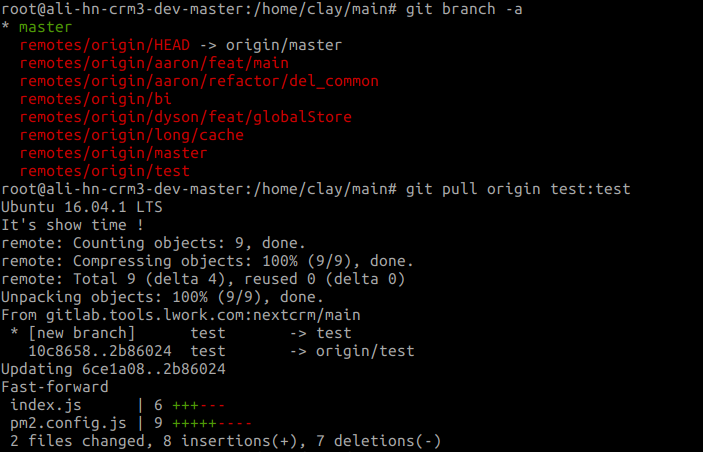
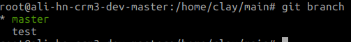

# 常用命令

```text
git branch 查看本地分支
git branch -a 查看远程分支
git checkout -b 新建分支
#当我想从远程仓库里拉取一条本地不存在的分支时
git fetch
git checkout -b 本地分支名 origin/远程分支名
git checkout -b test remotes/origin/test
git pull
git checkout 切换分支
#或者不用fetch,直接 git pull origin test:test
git pull <远程库名> <远程分支名>:<本地分支名>这种方式只会更新，不会自动切换到test分支

git pull 更新   git pull origin master 更新指定分支
git branch -a查看当前分支。
```

  git reflog 获取所有操作历史 git reset HEAD@{4} 或者 git reset --hard 提交的哈希值 \#重置到相应提交

```text
git fetch --all
git branch
git checkout master
git reset --hard origin/master
```

```text
git fetch origin 7.10.0
git checkout 7.10.0
git pull
```

2、查询用户信息

git config --list

3、如果push遇到在输入密码是出错后，就会报这个错误fatal: Authentication failed for

解决办法：

git config --system --unset credential.helper

之后你在push就会提示输入名称和密码

**设置与配置** **git config** Git 做的很多工作都有一个默认方式。 对于绝大多数工作而言,你可以改变 Git 的默认方式,或者根据你的偏好 来设置。 这些设置涵盖了所有的事,从告诉 Git 你的名字,到指定偏好的终端颜色,以及你使用的编辑器。 此 命令会从几个特定的配置文件中读取和写入配置值,以便你可以从全局或者针对特定的仓库来进行设置。 **git help** git help 命令用来显示任何命令的 Git 自带文档。 但是我们仅会在此附录中提到大部分最常用的命令,对于每 一个命令的完整的可选项及标志列表,你可以随时运行 git help  命令来了解。

**Command line instructions** Git global setup git config --global user.name "tony" git config --global user.email "tony@lwork.com"

**Create a new repository**

```text
git clone http://用户名：密码@gitlab.teanwork.com:8100/linuxshell/appinstall.git
git add README.md  单个文件    git add . 所有文件
git status
只要在 “Changes to be committed” 这行下面的，就说明是已暂存状态。如果此时提
交，那么该文件此时此刻的版本将被留存在历史记录中。
git commit -m "add README"描述
git push -u origin dev 上传  git push -u origin master 上传
```

