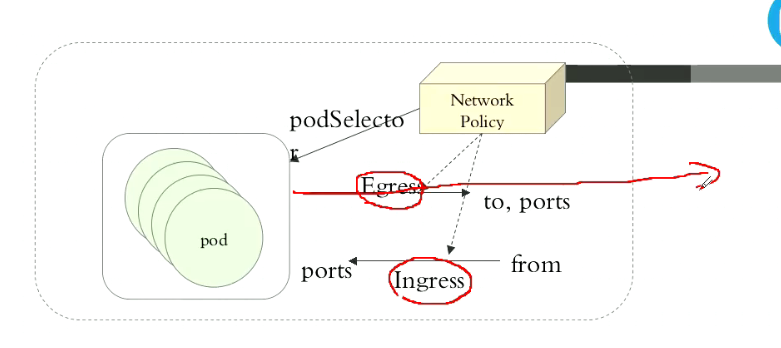
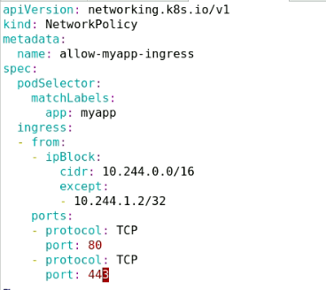

# flannel&calico

Kubernetes网络通信: \(1\) 容器间通信:同一个Pod内的多个容器间的通信, lo \(2\) Pod通信:Pod IP &lt;--&gt; Pod IP \(3\) Pod与Service通信:PodIP &lt;--&gt; ClusterIP \(4\) Service与集群外部客户端的通信; **要解决这四种通信** k8s用插件来实现 CNI： flannel不支持网络策略 calico 支持地址分配和网络策略 canal，Canal uses Calico for policy and Flannel for networking 。。。。。。 解决方案: 虚拟网桥 多路复用:MacVLAN 硬件交换:SR-IOV kubelet, /etc/cni/net.d/

flannel: 支持多种后端: VxLAN虚拟扩展局域网 \(1\) vxlan \(2\) Directrouting直接路由，同一网段，不用隧道 host-gw: Host Gateway UDP: flannel的配置参数: Network:flannel使用的CIDR格式的网络地址,用于为Pod配置网络功能; 10.244.0.0/16 -&gt; master: 10.244.0.0/24 node01: 10.244.1.0/24 ... node255: 10.244.255.0./24 10.0.0.0/8 六万多地址 10.0.0.0/24 ... 10.255.255.0/24 SubnetLen:把Network切分子网供各节点使用时,使用多长的掩码进行切分,默认为24位; SubnetMin:10.244.10.0/24 SubnetMax: 10.244.100.0/24 Backend:vxlan, host-gw, udp vxlan: `tcpdump -i ens32 -nn` `tcpdump -i cni0 -nn icmp` `tcpdump -i flannel.1 -nn icmp` `wget https://raw.githubusercontent.com/coreos/flannel/62e44c867a2846fefb68bd5f178daf4da3095ccb/Documentation/kube-flannel.yml` **calico: 开启 ipip 模式 （默认就是这样设置的）** **flannel: 使用 vxlan 模式，不要开启 DirectRouting （默认就是这样设置的）** **修改flannel配置，增加Directrouting**，**新集群建立之前修改**,可能会导致pod与pod不通，不建议使用

```text
  net-conf.json: |
    {
      "Network": "10.244.0.0/16",
      "Backend": {
        "Type": "vxlan",
        "Directrouting": true默认没有这一项，开启后，同一网段直接用物理网络通信
      }
    }
```

参考文档：[https://docs.projectcalico.org/v3.8/getting-started/](https://docs.projectcalico.org/v3.8/getting-started/) calico，三层，暂时只能使用iptalbes flannel网络+calico网络策略 有2种部署方式 1，Installing with the Kubernetes API datastore \(recommended\)共用k8setcd 2，Installing with the etcd datastore自带etcd  Egres出站，目标端口和地址可预测 Ingress入站，限制对方的地址，自己的端口 Network Policy 通过podSelector应用在哪个或哪些pod上 拒绝所有，放行已知，最安全 `kubectl explain networkpolicy` 网络策略: 名称空间: 拒绝所有出站,入站; 放行所有出站目标本名称空间内的所Pod; ingress-def.yaml

```text
apiVersion: networking.k8s.io/v1
kind: NetworkPolicy
metadata:
  name: deny-all-ingress
  namespace: dev
spec:
  podSelector: {}
  policyTypes:
  - Ingress默认拒绝 而没写Egres，则Egres默认都放行
```



