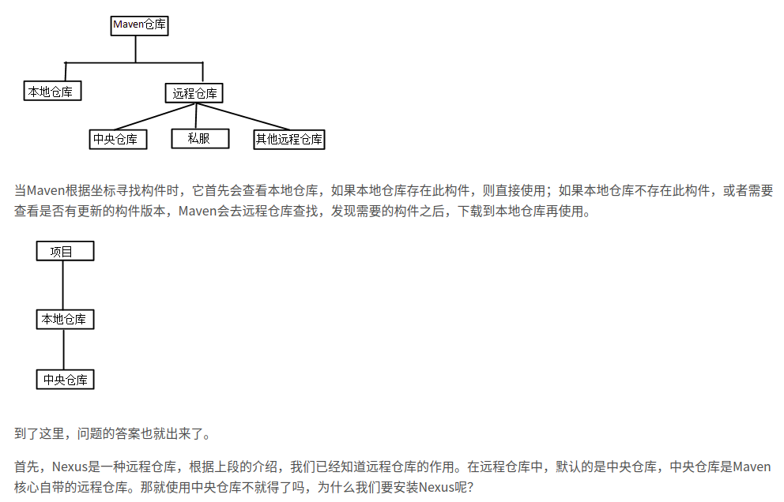

# maven

## 

[https://www.yiibai.com/maven/](https://www.yiibai.com/maven/) 教程

**package**命令完成了项目编译、单元测试、打包功能，但没有把打好的可执行jar包（war包或其它形式的包）布署到本地maven仓库和远程maven私服仓库

**install**命令完成了项目编译、单元测试、打包功能，同时把打好的可执行jar包（war包或其它形式的包）布署到本地maven仓库，但没有布署到远程maven私服仓库

**deploy**命令完成了项目编译、单元测试、打包功能，同时把打好的可执行jar包（war包或其它形式的包）布署到本地maven仓库和远程maven私服仓库

参考[http://maven.apache.org/guides/getting-started/index.html\#](http://maven.apache.org/guides/getting-started/index.html#) Maven有三套相互独立的生命周期，而且“相互独立”，这三套生命周期分别是：

* Clean Lifecycle 在进行真正的构建之前进行一些清理工作。
* Default Lifecycle 构建的核心部分，编译，测试，打包，部署等等。
* Site Lifecycle 生成项目报告，站点，发布站点。

你可以仅仅调用clean来清理工作目录，仅仅调用site来生成站点。当然你也可以直接运行**mvn clean install site**运行所有这三套生命周期。 `mvn clean` 移除所有上一次构建生成的文件 Maven的最重要的Default生命周期，绝大部分工作都发生在这个生命周期中，这里是比较重要和常用的阶段：

* validate
* generate-sources
* process-sources
* generate-resources
* process-resources     复制并处理资源文件，至目标目录，准备打包。
* compile     编译项目的源代码。
* process-classes
* generate-test-sources 
* process-test-sources
* generate-test-resources
* process-test-resources     复制并处理资源文件，至目标测试目录。
* test-compile     编译测试源代码。
* process-test-classes
* test     使用合适的单元测试框架运行测试。这些测试代码不会被打包或部署。
* prepare-package
* package     接受编译好的代码，打包成可发布的格式，如 JAR 。
* pre-integration-test
* integration-test
* post-integration-test
* verify
* install     将包安装至本地仓库，以让其它项目依赖。
* deploy     将最终的包复制到远程的仓库，以让其它开发人员与项目共享。

  ```text
  mvn clean install
  mvn clean deploy
  ```

