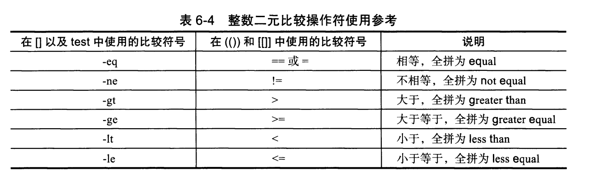

# 第六章 shell脚本的条件测试

`[ -f /tmp/1.txt ] && echo 1 || echo 0` `[[ -f /tmp/1.txt ]] && echo 1 || echo 0`

## 如果/tmp/1.txt文件存在就输出1，否则（\|\|）就输出0

1. **文件测试表达式**

   ```text
   -d #文件存在且为目录为真
   -f #文件存在为真
   -e #文件存在为真。不辨别是目录还是文件
   ```

   **特殊条件测试表达式案例**

   ```text
   [ 条件1 ] && {
    命令 1
    命令 2
    命令 3
   }
   [ [条件1 ]] && {
    命令 1
    命令 2
    命令 3
   }
   [ -f /etc ] || {
    命令 1
    命令 2
    命令 3
   }
   ```

   **在做测试判断时，不一定非要按照"前面的操作成功了如何，否则如何"的方法来进行。直接做部分判断，有时看起来更简洁**

   例如：

   `[ -x oldboy ] && echo 1` 如果可执行，则输出1；否则不做任何输出

   `[ -f /etc ] || echo 0`如果/etc是文件不成立，则输出0；如果成立，则不做任何输出。

2. **字符串测试表达式**

   ```text
   -n "字符串" 不为0为真 n可以理解为no zero
   -z "字符串" 为0为真       z可以理解为zero
   " 串1 "=" 串2 "
   " 串1 " !=" 串2 "
   ```

   **括号2边最少空一格，字符串加双引号**

3. **整数二元比较操作符**

   

   **\[\[\]\]是扩展的test命令，其语法更丰富更复杂。对于实际工作中的常规比较不建议使用，除非特殊的正则匹配等**

4. **逻辑操作符**

