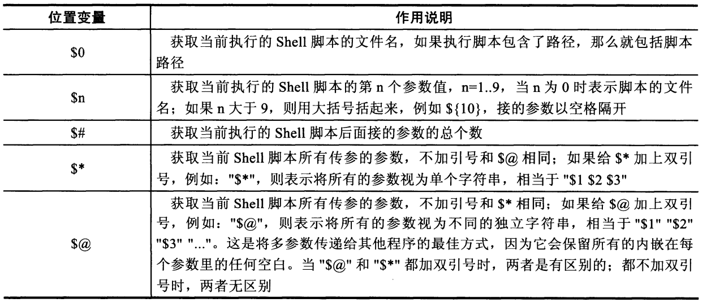

# 第四章变量知识进阶和实践

 1、**利用$0取出路径和名字**

```text
tony@z6:~/scripts/tony$ cat n.sh 
#!/bin/bash
#Author:tony
#Time:2019-09-23 15:11:17
time=$(date "+%Y-%m-%d %H:%M")
dirname $0
basename $0

tony@z6:~/scripts/tony$ sh /home/tony/scripts/tony/n.sh 
/home/tony/scripts/tony
n.sh
```

2、**通过$\#获取脚本传参的个数**

```text
tony@z6:~/scripts/tony$ cat q.sh
#!/bin/bash
#Author:tony
#Time:2019-10-12 16:52:34
echo $1 $2 $3 $4 $5 $6 $7 $8 $9
*****
tony@z6:~/scripts/tony$ sh q.sh {a..z}
a b c d e f g h i #只接收9个变量
26 #传入26个字符作为26个参数
```

**范例**

```text
if [ $# -ne 2 ]
  then
    echo "USAGE:/bin/bash $0 arg1 arg2"
# 给用户提示正确的用法，$0 打印脚本名字和路径
    exit 1 #若不满足要求，则退出脚本，返回值1
fi
echo $1 $2 #满足要求则打印$1,$2
```

```text
tony@z6:~$ sh 1.sh 
USAGE:/bin/bash 1.sh arg1 arg2
tony@z6:~$ sh 1.sh test1 test2
test1 test2
```

3、**$\* 和 $@** ，获取当前shell脚本所有传参的参数

```text
tony@z6:~$ set -- "I am" handsome boy
#通过set 设置三个字符串参数 -- 表示清除所有参数变量，重新设置后面的参数变量。
tony@z6:~$ echo $#
3
tony@z6:~$ echo $1
I am
tony@z6:~$ echo $2
handsome
tony@z6:~$ echo $3
boy
tony@z6:~$ echo $*
I am handsome boy
tony@z6:~$ echo $@
I am handsome boy
##########两者不带引号###############
tony@z6:~$ for i in $*;do echo $i;done
I
am
handsome
boy
tony@z6:~$ for i in $@;do echo $i;done
I
am
handsome
boy
##########两者带引号###############
tony@z6:~$ echo "$*"
I am handsome boy
tony@z6:~$ echo "$@"
I am handsome boy
tony@z6:~$ for i in "$*";do echo $i;done
I am handsome boy
tony@z6:~$ for i in "$@";do echo $i;done
I am
handsome
boy
```

4、bash shell 内置变量命令**echo**

```text
-n #不换行输出内容
-e #解析转义字符
#转义字符
\n #换行
\r #回车
\t #制表符
\b #退格
\v #纵向制表符
```

**例子**

```text
tony@z6:~/scripts$ echo 1;echo 2
1
2
tony@z6:~/scripts$ echo -n 1;echo 2
12
tony@z6:~/scripts$ echo -e "1\2\3\4\n"
1\2\3\4

tony@z6:~/scripts$ echo "1\2\3\4\n"
1\2\3\4\n
```

