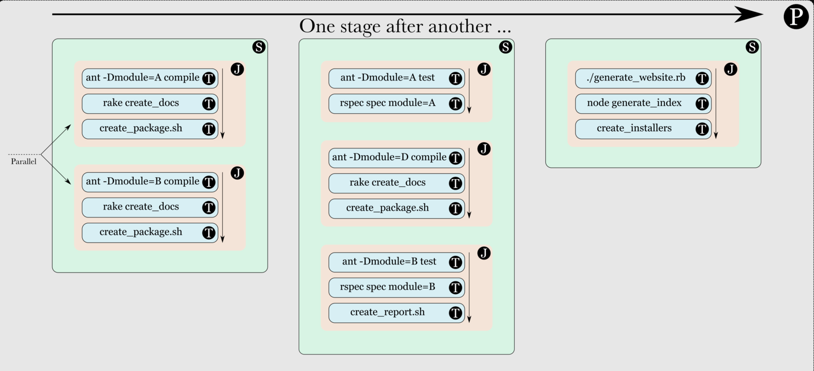

# GoCD

 P代表pipeline，S代表stage，J代表job，T代表task

Pipeline可由若干个stage组成，stage之间可以设置依赖关系，默认上游stage失败的时候不会触发下游stage。stage可由多个job组成，但多个job一般用在并行任务的用例中（例如并行构建多个模块），它们之间是没有依赖关系的，所以如果你希望某个stage执行一系列有依赖关系的动作，应该使用单个job并为其设置多个task，而不是多个job。

```text
/var/lib/go-server       #contains the binaries and database
/etc/go                  #contains the pipeline configuration files
/var/log/go-server       #contains the server logs
/usr/share/go-server     #contains the start script
/etc/default/go-server   #contains all the environment variables with default values. These variable values can be changed as per requirement.
```

Notice that the GoCD Agent independently checks out the repository, meaning that the version control systems of your materials \(Git, SVN, etc\) need to be available on the GoCD Agent as well.

gocd 插件[https://github.com/gocd-contrib](https://github.com/gocd-contrib)

其实，你需要的是一款叫做“script-executor-task”的GoCD插件。是的，你没有看错，GoCD也是有插件的！有了这款插件后，你就可以像shell脚本一样编排指令，从而愉快地合并臃肿的task了。 值得一提的是，这个插件的初衷是简化task中命令的书写和排序，而不提倡滥用它编排大量琐碎的指令。不管是用jenkins还是GoCD，最佳实践是将指令放到脚本文件中，并纳入代码版本仓库（SCM）。可以签出的脚本方便团队所有人查看，更改也有迹可循，便于协作；另一方面脚本与工具的耦合也最小（往往就是一行命令），我们将在“实现Pipeline as Code”一节中继续讨论这个话题。

