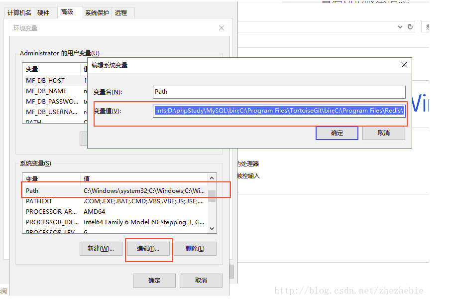

# nssm

引用[https://www.cnblogs.com/tianfang/p/7912648.html](https://www.cnblogs.com/tianfang/p/7912648.html) 一、下载安装 [https://nssm.cc/](https://nssm.cc/) 解压软件包获取路径`D:\tools\nssm-2.24\win64` 将这个路径添加到windows全局环境变量 点击我的电脑右键--高级系统设置--高级--环境变量，然后  二、 nssm install deployagent nssm edit deployagent 进入编辑模式 选择路径，确定。服务注册到了windows服务，使用服务进行管理，可后台运行。 **也可以是bat，如果不行可以尝试将bat转化为exe** 三、 NSSM是一个服务封装程序，它可以将普通exe程序封装成服务，使之像windows服务一样运行。同类型的工具还有微软自己的srvany，不过nssm更加简单易用，并且功能强大。它的特点如下：

支持普通exe程序（控制台程序或者带界面的Windows程序都可以） 安装简单，修改方便 可以重定向输出（并且支持Rotation） 可以自动守护封装了的服务，程序挂掉了后可以自动重启 可以自定义环境变量 这里面的每一个功能都非常实用，使用NSSM来封装服务可以大大简化我们的开发流程了。

开发的时候是一个普通程序，降低了开发难度，调试起来非常方便 安装简单，并且可以随时修改服务属性，更新也更加方便 可以利用控制台输出直接实现一个简单的日志系统 不用考虑再加一个服务实现服务守护功能

三、一些命令 nssm查看帮助

