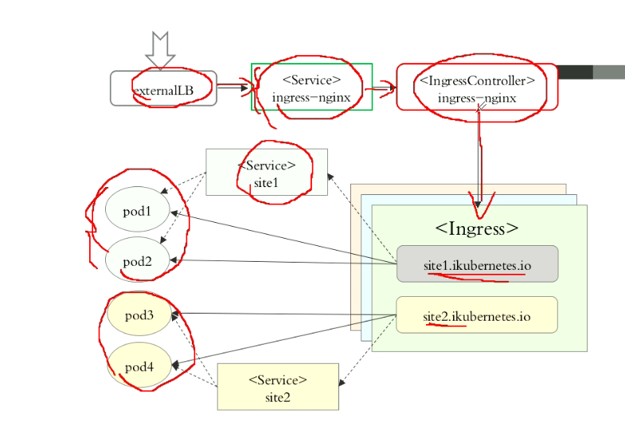

安装指南
[https://kubernetes.github.io/ingress-nginx/deploy/](https://kubernetes.github.io/ingress-nginx/deploy/)
Ingress  Controller 拥有7层代理和调度能力。
有三种选择**Nginx**,**Traefik**,**Envoy**  
nginx在k8s上每次变动都需要重载，而traefik和envoy会动态自动加载，在k8s中更合适   
url 映射或虚拟主机
kubectl explain ingress
代理的service必需是无头服务？？？

 #证书需要转化为secret
`kubectl create secret tls tomcat-ingress-secret --cert=tls.crt --key=tls,key`
```
apiVersion: extensions/v1beta1
kind: Ingress
metadata:
    name: ingress-tomcat-tls
    namespace: default
    annotations:注解，k8s才能是别到对应的规则
        kubernetes.io/ingress.class: "nginx" 才能转化为相匹配的controller规则
spec:
    tls:
    - hosts:
      - tomcat.magedu.com
      secretName: tomcat-ingress-secret
    rules:定义规则
    - host: tomcat.magedu.com
      http:
        paths:
        - path: / 
          backend:
            serviceName: tomcat
            servicePort: 8080
```
**ingress在安装时候指定了nodeport为30080和30443，所以访问时候应该域名加端口
跳板机nginx所有80和443指向ingress所在服务器内网的30080和30443**