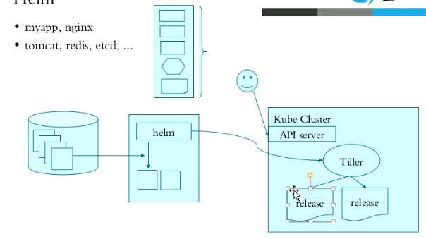

当前版本，2.14.3
核心术语:
  Chart:一个helm程序包;
Repository:Charts仓库,https/http服务器;
Release:特定的Chart部署于目标集群上的一个实例;
Chart -> Config -> Release
程序架构:
helm:客户端,管理本地的Chart仓库,管理Chart, 与Tiller服务器交互,发送Chart,实例安装、查询、卸载等
操作
Tiller:服务端,接收helm发来的Charts与Config,合并生成relase;

**RBAC配置文件示例**:
https://github.com/helm/helm/blob/master/docs/rbac.md
**官方可用的Chart列表**:
https://hub.kubeapps.com/

helm常用命令:
**release管理**:
install
delete
upgrade/rollback
list
history:release的历史信息;
status:获取release状态信息; `helm status name`
**chart管理**:
create
fetch
get
inspect `helm inspect stable/jenkins` `helm search memcached`
package
verify