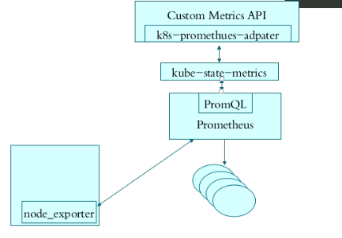
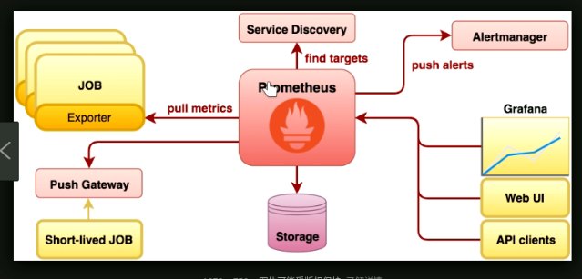

**资源指标API及自定义指标API**
资源指标:metrics-server
自定义指标:prometheus, k8s-prometheus-adapter
新一代架构:
    核心指标流水线:由kubelet、metrics-server以及由API server提供的api组成;CPU累积使用率、内存实时使用率、Pod的资源占用率及容器的磁盘占用率;
    监控流水线:用于从系统收集各种指标数据并提供终端用户、存储系统以及HPA,它们包含核心指标及许多非核心指标。非核心指标本身不能被k8s所解析
    metrics-server:API server，服务于资源指标。**必须要部署的。**
[https://github.com/kubernetes-incubator/metrics-server](https://github.com/kubernetes-incubator/metrics-server)最新版本
[https://github.com/kubernetes/kubernetes/tree/master/cluster/addons/metrics-server](https://github.com/kubernetes/kubernetes/tree/master/cluster/addons/metrics-server)整合进了k8s中的，通过认证的
**部署metrics-server**
版本k8s,1.15.0,metrics0.3.3
修改下载后的清单
```
resource-reader.yaml

rules:
- apiGroups:
  - ""
  resources:
  - pods
  - nodes
  - nodes/stats    #新增这一行
  - namespaces
  verbs:
  - get
  - list
  - watch
####################################################
metrics-server-deployment.yaml

containers metrics-server 启动参数，修改好的如下：
 containers:
      - name: metrics-server
        image: k8s.gcr.io/metrics-server-amd64:v0.3.3
        command:
        - /metrics-server
        - --metric-resolution=30s
        - --kubelet-insecure-tls
        - --kubelet-preferred-address-types=InternalIP,Hostname,InternalDNS,ExternalDNS,ExternalIP
        # These are needed for GKE, which doesn't support secure communication yet.
        # Remove these lines for non-GKE clusters, and when GKE supports token-based auth.
        #- --kubelet-port=10255
        #- --deprecated-kubelet-completely-insecure=true
----            
# 修改containers，metrics-server-nanny 启动参数，修改好的如下：
command:
          - /pod_nanny
          - --config-dir=/etc/config
          - --cpu=80m
          - --extra-cpu=0.5m
          - --memory=80Mi
          - --extra-memory=8Mi
          - --threshold=5
          - --deployment=metrics-server-v0.3.3
          - --container=metrics-server
          - --poll-period=300000
          - --estimator=exponential
          # Specifies the smallest cluster (defined in number of nodes)
          # resources will be scaled to.
          #- --minClusterSize={{ metrics_server_min_cluster_size }}
```

验证
~~~
kubectl get apiservices
~~~
`kubectl proxy --port=8080`
`curl http://localhost:8080/apis/metrics.k8s.io/v1veta1`
`curl http://localhost:8080/apis/metrics.k8s.io/v1veta1/nodes`
`curl http://localhost:8080/apis/metrics.k8s.io/v1veta1/pods`
kubectl top nodes
kubect top pods -n kube-system

**部署prometheus**
版本k8s,1.15.0,metrics0.3.3
引用文档[https://github.com/kubernetes/kubernetes/tree/master/cluster/addons/prometheus](https://github.com/kubernetes/kubernetes/tree/master/cluster/addons/prometheus)
This add-on is an experimental configuration of k8s monitoring using Prometheus used for e2e tests.addons上面的仅仅在测试环境测试过
For production use check out more mature setups like[Prometheus Operator](https://github.com/coreos/prometheus-operator)and[kube-prometheus](https://github.com/coreos/prometheus-operator/tree/master/contrib/kube-prometheus).推荐使用
*****


文件多下载于[https://github.com/ikubernetes](https://github.com/ikubernetes)
1.安装node_exporter
2.安装prometheus-server
```
kind: ConfigMap
apiVersion: v1
metadata:
  labels:
    app: prometheus
  name: prometheus-config
  namespace: monitoring
data:
  prometheus.yml: | 生成prometheus主配置文件
```
3.安装kube-state-metrics
4.安装k8s-prometheus-adapter，需要用到https，需要k8s认可的CA签署的证书.安装这个是为了HPA自动伸缩。光监控应该不用安装
        1.私钥
`cd /etc/kubernetes/pki/`
`(umask 077; openssl genrsa -out serving.key 2048)`
        2.生成csr签名请求文件
`openssl req -new -key serving.key -out serving.csr -subj "/CN=serving"`
`openssl req -new -key serving.key -out serving.csr -subj "/C=CN/ST=GD/L=SZ/O=vihoo/OU=dev/CN=vivo.com/emailAddress=yy@vivo.com"`
        3.用CA签证,使用 CA 证书及CA密钥 对请求签发证书进行签发，生成 x509证书
`openssl x509 -req -in serving.csr -CA ./ca.crt -CAkey ./ca.key -CAcreateserial -out serving.crt -days 3650`**默认都是一年**
        4. 创建secret
        `kubectl create secret generic cm-adapter-serving-certs --from-file=./serving.crt --from-file=./serving.key -n monitoring`
        5.验证
        `kubectl get all -n monitoring`
5.安装grafana，可选
[https://github.com/coreos/kube-prometheus/blob/master/manifests/grafana-deployment.yaml](https://github.com/coreos/kube-prometheus/blob/master/manifests/grafana-deployment.yaml)
部分修改
`kubectl create secret tls grafana.test.com --cert=./grafana.crt --key=./test.key -n monitoring`
`kubectl create secret tls prometheus.test.com --cert=./prometheus.crt --key=./test.key -n monitoring`
```
    spec:
      containers:
      - env:
        - name: GF_SERVER_HTTP_PORT
          value: "3000"
        - name: GF_AUTH_BASIC_ENABLED
          value: "yes"
        - name: GF_AUTH_ANONYMOUS_ENABLED
          value: "no"
        - name: GF_SECURITY_ADMIN_PASSWORD 
          value: "highlowtop"
        - name: GF_SERVER_ROOT_URL
          value: /

        volumeMounts:
        - mountPath: /var/lib/grafana
          name: grafana-storage
          subPath: grafana-storage
      dnsPolicy: ClusterFirst
      restartPolicy: Always
      tolerations:
      - key: node-role.kubernetes.io/master
        effect: NoSchedule
      volumes:
      - hostPath:
          path: /etc/ssl/certs
          type: ""
        name: ca-certificates
      - hostPath:
          path: /data/
          type: Directory
        name: grafana-storage
```
6 ingress
nginx-443->ingress->grafana
根据上面的证书添加到nginx