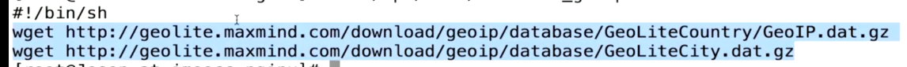

geoip_module模块
yum install nginx-module-geoip
```
The GeoIP dynamic modules for nginx have been installed.
To enable these modules, add the following to /etc/nginx/nginx.conf
and reload nginx:

    load_module modules/ngx_http_geoip_module.so;
    load_module modules/ngx_stream_geoip_module.so;

Please refer to the modules documentation for further details:
http://nginx.org/en/docs/http/ngx_http_geoip_module.html
http://nginx.org/en/docs/stream/ngx_stream_geoip_module.html
```


`wget http://geolite.maxmind.com/download/geoip/database/GeoliteCountry/GeoIP.dat.gz`